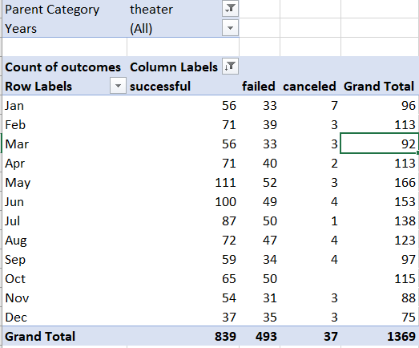
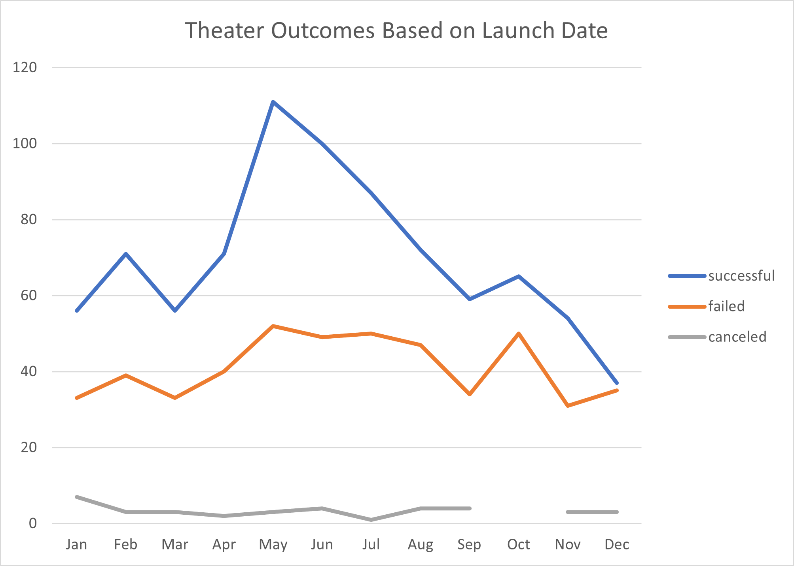
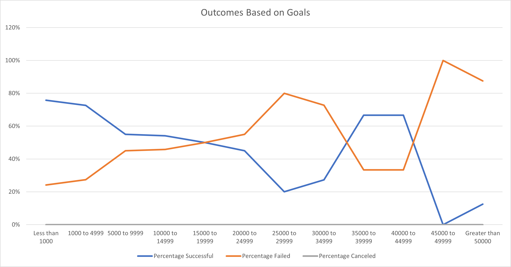

# Kickstarting with Excel

## Overview of Project

### Purpose

What factors contribute to the success or failure of theater crowdfunding campaigns? This project seeks to answer that question using data drawn from Kickstarter. Using Excel, I compare the outcomes of theater projects based on both their launch dates and on their funding goals.

## Analysis and Challenges

### Analysis of Outcomes Based on Launch Date

To display the outcomes of theater campaigns by their launch dates, I first created a pivot table using the data on the Kickstarter Worksheet. I added the Parent Category and Years fields to Filters, Outcomes to Columns, Date Create Conversion to Rows, and Count of Outcomes Values.

After creating the pivot table, I filtered Parent Category to show only theater campaigns, I filtered the column labels to exclude live campaigns, and I sorted the column labels in descending order. 

I then created a line chart from the pivot table in order visualize the relationship between launch dates and campaign outcome.

### Analysis of Outcomes Based on Goals

The second part of my analysis looked at the relationship between funding goals and campaign success. On the Outcomes Based on Goals, I grouped campaign funding goals for theater campaigns into dollar-amount ranges. I calculated the number of successful, failed, and canceled campaigns for each dollar-amount range by using the COUNTIFS() function. For example, the following function displays the number of successful theater campaigns with goals between $1000 and $4999.

>=COUNTIFS(Kickstarter!$D:$D,">999",Kickstarter!$D:$D,"<5000",Kickstarter!$F:$F,"successful",Kickstarter!$Q:$Q,"theater")
>
I calculated the percentage of successful, failed, and canceled projects, and I created the following line chart to display the results.

### Challenges and Difficulties Encountered

I completed this project without significant difficulties. The analysis of outcomes based on goals required inputting a number of functions to get the correct count for each outcome and dollar-amount range. It required careful proofing to ensure that the correct values were returned, and this task might be better accomplished by using scripting.

## Results

- What are two conclusions you can draw about the Outcomes based on Launch Date?

Visual inspection of the Outcomes based on Launch Date chart indicates that the success rate of theater campaigns clearly peaks in May. April and June are also quite favourable launch dates for theater projects. The number of successful theater projects sharply declines toward the end of the year, reaching a low point in December.

- What can you conclude about the Outcomes based on Goals?

Theater campaigns that aim to raise less than $5000 are much more likely to succeed than projects with higher funding goals. Projects with goals of less than $5000 succeed more than 70% of the time. The success rate declines to 55% for projects between $5000 and $9999, and drops further as funding goals increase. There is a spike in the success rate for projects with goals between $35000 and $45000, but there was a only a small number of campaigns with goals that fell in this range.

- What are some limitations of this dataset?

Kickstarter is a relatively new platform, and the dataset can only provide information on a short period of time. There were only 26 theater campaigns launched on Kickstarter before 2014; the last month included in the dataset is February 2017. It is possible that trends for theater projects could change as the platform matures.

The dataset indicates the country in which each campaign took place, but does not provide more detailed location information. This is important information for theater projects. Further data might help to determine if some markets are more favourable than others for crowdfunding plays.

It would also be useful to know which Kickstarter campaigns have creators with previous experience running projects on the platform. The expected outcomes might be different for a first-time creator compared to that of a Kickstarter veteran. Further research on this question might help to calibrate the expectations for the client. 

- What are some other possible tables and/or graphs that we could create?

It might be useful to create a graph of outcomes based on campaign duration to determine if there is an optimal length of time for projects to be live on Kickstarter. Additionally, graphing the average donation size against the funding goal of successful campaigns could help to determine the ideal size of pledge levels. 
