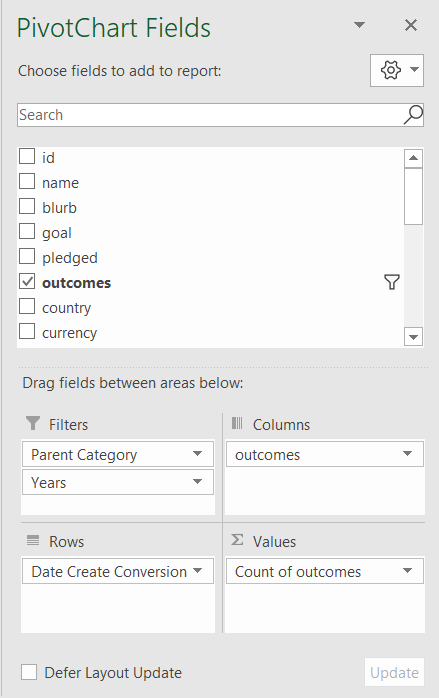

# Kickstarting with Excel

## Overview of Project

### Purpose

The purpose of the project was to examine crowdfuding campaigns for theater projects and identify factors that contribute to their success or failure. To accomplish this, I used Excel to analyze crowdfunding data drawn from Kickstarter. Examining this dataset, I was able to identify the most months in which to launch a Kickstarter campaign, and the funding goals that are most likely to succeed.

## Analysis and Challenges

### Analysis of Outcomes Based on Launch Date

To display the outcomes of theater campaigns by their launch dates, I first created a pivot table using the data on the Kickstarter Worksheet. I added the Parent Category and Years fields to Filters, Outcomes to Columns, Date Create Conversion to Rows, and Count of Outcomes Values.

After creating the pivot table, I filtered Parent Category to show only theater campaigns, I filtered the column labels to exclude live campaigns, and I sorted the column labels in descending order. 

I then created a line chart from the pivot table in order visualize the relationship between launch dates and campaign outcome.

### Analysis of Outcomes Based on Goals

The second part of my analysis looked at the relationship between funding goals and campaign success. On the Outcomes Based on Goals, I grouped campaign funding goals for theater campaigns into dollar-amount ranges. I calculated the number of successful, failed, and canceled campaigns for each dollar-amount range by using the COUNTIFS() function. For example, the following function displays the number of successful theater campaigns with goals between $1000 and $4999.

>=COUNTIFS(Kickstarter!$D:$D,">999",Kickstarter!$D:$D,"<5000",Kickstarter!$F:$F,"successful",Kickstarter!$Q:$Q,"theater")
>
I calculated the percentage of successful, failed, and canceled projects, and I created the following line chart to display the results.

### Challenges and Difficulties Encountered

## Results

- What are two conclusions you can draw about the Outcomes based on Launch Date?

- What can you conclude about the Outcomes based on Goals?

- What are some limitations of this dataset?

- What are some other possible tables and/or graphs that we could create?
